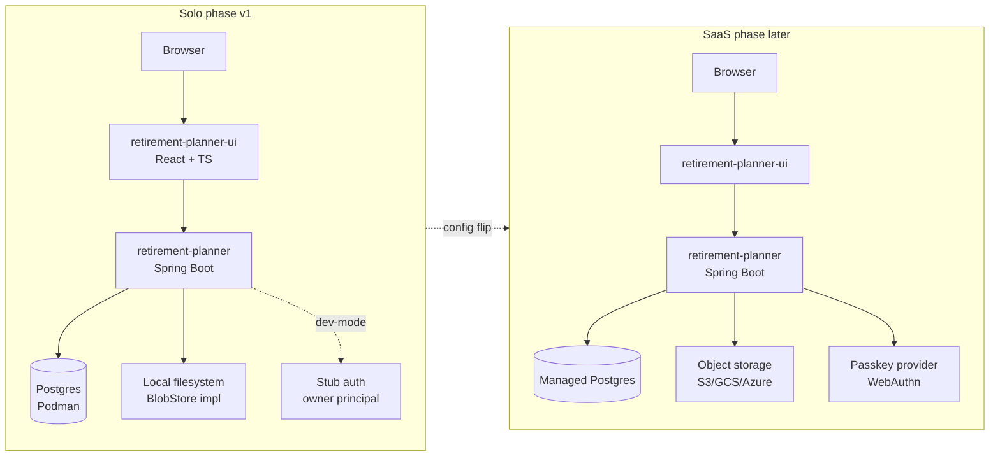

# ADR-001: Platform & Infrastructure

- **Status**: Accepted
- **Date**: 2026-06-08
- **Deciders**: Owner
- **Related**: DISC-001

## Context

The retirement planner needs a delivery surface, a local development story,
an authentication approach, and a posture for eventual SaaS deployment.
These choices are intertwined enough to live in one ADR rather than four
small ones.

Constraints from discovery:
- Java + Spring Boot backend (matches the owner's stack)
- React + TypeScript frontend
- Solo use today, multi-tenant SaaS later — no rewrite when that happens
- Local containers run on Podman, not Docker (licensing)
- Cloud-portable; specific cloud target deferred

## Decision

### Repository Topology
Two separate repositories:
- `retirement-planner` (this repo) — Java/Spring Boot backend, infrastructure-as-code, ADRs and PRD
- `retirement-planner-ui` (future) — React/TypeScript frontend

Mirrors the `places-maps-spring` / `places-maps-react` split. Independent CI,
clear API contract enforced by an OpenAPI spec generated from the backend.

### Authentication
**Passkeys (WebAuthn)** is the chosen primary credential.

For v1 (solo, local), authentication is stubbed: a single hardcoded
"owner" principal injected by a dev-mode `SecurityFilterChain`. The
`AuthenticationProvider` interface is real; only the implementation is
trivial. A flag (`app.auth.mode=stub|passkey`) controls which is wired.

For SaaS phase, the passkey provider is enabled. No password-based fallback;
recovery via secondary passkey on a different device.

### Local Development
- `compose.yaml` (already in repo) describes Postgres (and any future
  sidecars) for local development.
- Podman Compose is the assumed runner. Compose syntax is Docker-Compose-
  compatible, so contributors using Docker still work — but documentation
  and scripts say `podman` / `podman-compose`.

### Deployment Posture
Cloud-agnostic at v1:
- No cloud SDKs in production code paths. Object storage (for Parquet
  in SaaS) is accessed through an interface with a local-filesystem
  implementation for dev and an S3/GCS/Azure-Blob implementation chosen
  later.
- Configuration via Spring profiles (`local`, `prod`) and externalized
  config — no provider-specific assumptions baked in.
- Container image built with a multi-stage Dockerfile that Podman can build.

## Rationale

- **Two repos** preserves an explicit API contract and matches the owner's
  established workflow. A monorepo would conflate Java and TypeScript
  toolchains and root-level pom/package.json choreography for limited gain.
- **Passkeys** sidestep password-management entirely and are well-supported
  by Spring Security's WebAuthn module. Stubbing v1 keeps solo use
  frictionless without rebuilding the auth layer when SaaS arrives.
- **Podman** matches the owner's licensing position. Compose-compatible so
  no lock-in.
- **Cloud-agnostic deferral** is correct given the deployment-target
  question was explicitly punted. The only commitment is "don't write
  AWS-only code in v1."

## Consequences

**Positive**
- Frontend team / future contributor can work on UI without touching backend repo
- SaaS migration is a config change for storage + a flag flip for auth, not a rewrite
- Local dev works without a cloud account

**Negative**
- Two repos means two CI pipelines and a coordination cost on cross-cutting changes
- Stubbed auth in v1 means the passkey integration isn't exercised until SaaS work begins — risk of late-stage surprises. Mitigation: write integration tests against the real passkey provider as part of v1 even if it's not the default.
- Object-storage abstraction is dead code in v1 (filesystem-only). Acceptable cost.

## Alternatives Considered

- **Monorepo** — rejected; conflates toolchains, no clear payoff for solo dev.
- **OAuth/social login** — rejected; passkeys are a better long-term primitive and the owner's use case doesn't need third-party identity.
- **Docker Desktop** — rejected per licensing constraint.
- **Pick AWS/Fly/Render now** — rejected; deferred per DISC-001.

## Diagram — Solo vs SaaS topology

The dashed arrow is the central claim of this ADR: solo→SaaS is a
configuration change (auth mode, BlobStore implementation, Postgres
URL), not a rewrite.

## Notes

- Document Podman commands in the eventual `DEVELOPER_GUIDE.md`. Include a one-liner that maps Docker invocations to Podman for contributors used to Docker.
- The `client.io.github.xmljim.retirement.retirementplanner.client` package will hold the object-storage interface (probably `BlobStore`).
