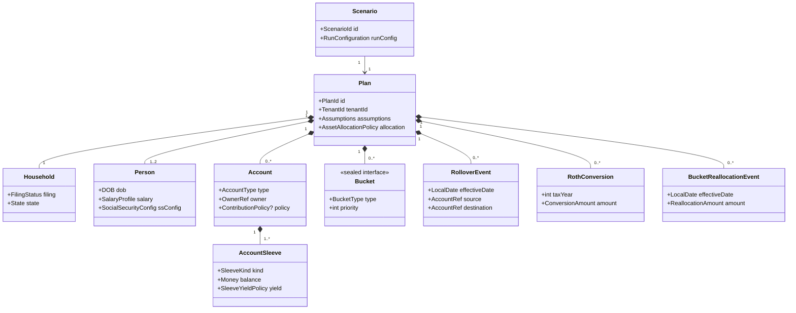
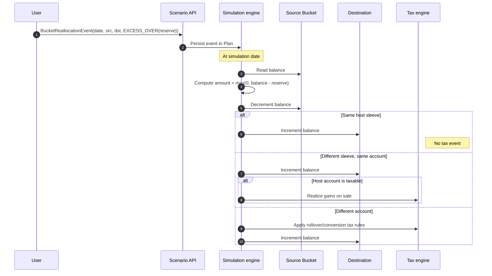

# ADR-002: Domain Model — Household, Spouses, Accounts, Buckets, Rollovers

- **Status**: Accepted
- **Date**: 2026-06-08
- **Deciders**: Owner
- **Related**: DISC-001, ADR-003 (contributions), ADR-004 (tax), ADR-006 (persistence)

## Context

The spreadsheet's domain model is implicit and flat — a handful of named
cells and one anonymous retirement balance. The application needs an
explicit domain model that:

- Supports per-spouse incomes, contributions, and accounts
- Supports multiple account types with distinct tax treatment
- Treats buckets (Bridge, Travel, Bucket-list, Healthcare, Legacy) as
  first-class extensible entities — not hard-coded categories
- Models inter-account rollovers as discrete user-defined events
- Is shaped to evolve into multi-tenant SaaS without restructure

## Decision

### Aggregate Roots
A **`Plan`** is the top-level aggregate. Each Plan belongs to a `User`
(SaaS-future) or to the implicit "owner" principal (solo). A Plan
contains:

- **`Household`** — demographics, filing status, state of residence
- **`Person`** (1..2) — each spouse: DOB, salary timeline, SS election
- **`Account`** (0..n) — Trad/Roth/HSA/Taxable/etc., owned by a Person OR Joint
- **`Bucket`** (0..n) — goal-based spending pools, polymorphic by `BucketType`
- **`RolloverEvent`** (0..n) — explicit inter-account moves with date
- **`Assumptions`** — shared inputs (inflation, return rates, asset allocation)

A **`Scenario`** is a snapshot of a Plan plus a `RunConfiguration`
(deterministic vs. Monte Carlo, seed, simulation count).

### Account Model
`Account` is a single entity with an `AccountType` enum:
- `TRADITIONAL_401K`, `ROTH_401K`, `TRADITIONAL_IRA`, `ROTH_IRA`,
  `HSA`, `TAXABLE_BROKERAGE`, `CASH`, `PENSION` (income, not balance),
  `ANNUITY` (deferred until later)

Each account has:
- `owner: PersonRef | JOINT`
- `sleeves: List<AccountSleeve>` — see below
- `contributionPolicy: Optional<ContributionPolicy>` — see ADR-003
- `taxTreatment: derived from AccountType`

Tax treatment is data on the enum, not subclasses. Keeps the JPA mapping
single-table and the engine free of `instanceof` chains.

### Account Sleeves
A sleeve is a **slice of an account by asset class or behavior**.
Within a single Traditional IRA you may have:
- A cash sleeve (yielding ~4–5% in a money-market fund)
- An equity sleeve (subject to glide-path allocation)
- A bond sleeve

Sleeves are not separate accounts at the custodian — they're a way for
the model to recognize that the cash inside an IRA is *real cash
earning real yield*, distinct from the equity allocation that's
subject to market returns and Monte Carlo draws.

```java
record AccountSleeve(
    SleeveId id,
    SleeveKind kind,            // CASH | ASSET_ALLOCATION | FIXED_ALLOCATION
    Money balance,
    SleeveYieldPolicy yield     // FixedRate | MoneyMarket | TracksAllocation
) {}

public sealed interface SleeveKind {
    record Cash() implements SleeveKind {}
    record AssetAllocation() implements SleeveKind {}      // glide-path managed
    record FixedAllocation(Map<AssetClass, BigDecimal> weights) implements SleeveKind {}
}
```

The default for any account is a single `AssetAllocation` sleeve
holding the full balance — preserving the simple case for users who
don't want to model sleeves explicitly. Power users (and the engine,
when modeling buckets) can split an account into multiple sleeves.

Tax treatment is **per-account, not per-sleeve** — sleeves inherit the
host account's tax rules (a cash sleeve in a Trad IRA still defers tax
on yield until withdrawal, just like the equity sleeve).

### Bucket Hosting (revised: physical / virtual / sleeve-hosted)
Three hosting modes, determined by funding policy + host configuration:

- **Sleeve-hosted (physical-in-place)**: bucket balance lives on a
  specific sleeve within an account. Most natural fit for the user's
  example: a `BridgeBucket` hosted on the cash sleeve of a Trad IRA.
  The cash sleeve earns yield (per its `SleeveYieldPolicy`); the
  bucket's tracked balance is the same as the sleeve's balance (or
  a sub-balance if the sleeve hosts multiple buckets).
- **Virtual**: no balance — the bucket is a spending claim against a
  source account on demand (`PullOnDemand`, `Constraint`).
- **Account-hosted (legacy physical)**: bucket pinned to a whole
  account that has only a single sleeve. Equivalent to sleeve-hosted
  on that single sleeve. Kept as a convenience for the simple case.

Reallocation operates on **sleeve balances**:
- Reallocating between buckets that share a host sleeve: pure sub-balance reassignment, no asset movement, no tax event.
- Reallocating between buckets on different sleeves of the same account: an internal asset reallocation (e.g. sell some equity, hold cash). No tax event for tax-advantaged accounts; for taxable accounts, this *is* a sale and may realize gains — the tax engine (ADR-004) handles it.
- Reallocating between buckets on different accounts: governed by the same tax rules as `RolloverEvent` and `RothConversion`.

This refinement resolves the IRA-cash-sleeve case correctly: the
BridgeBucket is "physical" (real cash earning yield), but it lives
inside a Trad IRA wrapper, so withdrawals from it are still ordinary-
income taxable per ADR-004 — the wrapper's tax treatment dominates,
not the sleeve's cash-ness.

### Bucket Abstraction
`Bucket` is a sealed interface. Concrete implementations:
- `BridgeBucket` — pre-funded at retirement; covers monthly budget +
  healthcare from retirement to SS start
- `RecurringAnnualBucket` — e.g. Travel: $X/yr from age A to age B,
  configurable funding policy (sinking-fund or pull-on-demand)
- `OneTimeGoalBucket` — e.g. RV in 2032 for $100k; sinking-fund or
  pull-on-demand
- `HealthcareBucket` — explicit, separable from BridgeBucket so
  post-Medicare healthcare can also be modeled
- `LegacyTargetBucket` — constraint: ending portfolio value ≥ target.
  Influences success metrics; doesn't draw cash.

Each bucket implements:
```java
public sealed interface Bucket {
    BucketId id();
    BucketType type();
    FundingPolicy fundingPolicy();
    SpendingPolicy spendingPolicy();    // see "Adaptive Spending" below
    int priority();                      // lower = higher priority
    Stream<CashFlow> cashFlows(SimulationContext ctx);
}
```

`FundingPolicy` is itself a sealed interface:
- `PrefundAtRetirement(Money targetAtRetirement)`
- `SinkingFund(MonthlyContribution, sourceAccount)`
- `PullOnDemand(sourceAccount)`
- `Constraint(Money minimumAtEndOfPlan)` — for LegacyTargetBucket

New bucket types are added by implementing `Bucket` and registering with
the `BucketRegistry`. The simulation engine never switches on bucket
subtype.

### Adaptive Spending (Bucket Prioritization)
Buckets aren't only *what* to spend — they're *how* to spend under
different economic conditions. The engine evaluates a `SpendingPolicy`
each year that decides whether to fund/draw the bucket at full,
reduced, or zero level based on portfolio state.

```java
public sealed interface SpendingPolicy {
    SpendingDecision evaluate(BucketState bucket, PortfolioState portfolio,
                              MarketState market, int yearIndex);
}

record SpendingDecision(
    BigDecimal scaleFactor,    // 0.0..1.0 — multiply target spend by this
    boolean defer,             // skip this year, carry forward
    String rationale           // human-readable; surfaces in UI / reports
) {}
```

Concrete policies (sealed interface implementations):

- **`Fixed`** — always 1.0. The naive default; matches Sheet2.
- **`AcrossTheBoardReduction`** — when portfolio falls below a
  threshold (e.g. ≤ X% of plan target at this point), apply a uniform
  reduction (e.g. 0.85) to *all* buckets carrying this policy. Models
  "tighten the belt across everything."
- **`PriorityFirst`** — preserve high-priority buckets (Bridge,
  Healthcare) at 100%, scale lower-priority buckets first. Travel
  drops to 0.7, then 0.5, then 0.0 as conditions worsen; Bridge stays
  whole. Uses the `priority()` field to order.
- **`DeferredSink`** — for one-time goals: if market is down (e.g.
  trailing 12-month return below threshold), defer the spend to the
  next eligible year; carry the obligation forward. Models "we'll
  buy the RV next year if the market recovers."
- **`GuytonKlingerGuardrail`** — withdrawal-rate guardrails: if the
  current effective withdrawal rate exceeds a ceiling, cut spending
  by 10%; if below a floor, increase by 10%. Classic dynamic-spending
  rule.
- **`InflationFloor`** — never reduce spending below a real-dollar
  floor regardless of market conditions. Composable with the others
  (acts as a final clamp).
- **`AgeBasedDecline`** — models the empirical "retirement spending
  smile" (Blanchett 2014, others): real-dollar spending declines
  ~0.5–1.0% per year through retirement, with an optional uptick in
  late life. Parameterized:
  ```java
  record AgeBasedDecline(
      BigDecimal annualRealDeclineRate,    // e.g. 0.008 = 0.8%/yr decline
      Optional<LateLifeUptick> lateLife    // optional twilight-years bump
  ) implements SpendingPolicy {}

  record LateLifeUptick(
      int startAge,                        // e.g. 80
      BigDecimal annualRealIncreaseRate    // e.g. 0.02 = 2%/yr ramp
  );
  ```
  Crucially, this policy applies **only to discretionary buckets**,
  not Bridge or Healthcare. The whole point of separating Healthcare
  into its own bucket (ADR-002 above) is that the late-life uptick is
  *already captured* in the Healthcare bucket's own funding curve —
  applying an `AgeBasedDecline` with `LateLifeUptick` to a generic
  spending bucket would double-count. Recommended composition:
  - General spending bucket: `AgeBasedDecline(decline=0.008, lateLife=empty)` — declines through retirement, no twilight bump because Healthcare bucket handles that.
  - Healthcare bucket: its own age-indexed funding curve (separate from `SpendingPolicy`), or a `Fixed` policy if the user prefers flat real spend.
  - Travel bucket: `AgeBasedDecline(decline=0.02, lateLife=empty)` — travel typically declines faster than general consumption.

Composability: a bucket can stack policies via a `Composite` policy
that applies them in order (e.g. `PriorityFirst` then `InflationFloor`).

The engine's draw step becomes:

```
for each bucket (in priority order, highest priority first):
    targetSpend = bucket.targetSpendForYear(year)
    decision = bucket.spendingPolicy().evaluate(...)
    actualSpend = targetSpend × decision.scaleFactor (or 0 if deferred)
    record decision in scenario report
    draw actualSpend from bucket's source(s)
```

Deferred spend amounts accrue on the bucket as `carriedForward`
balance and become eligible for spend in subsequent years (subject to
that year's policy evaluation).

### Why this lives on `Bucket`, not on a global "drawdown strategy"
A global "spend less when markets drop" rule blurs which goals are
robust and which are aspirational. Putting the policy on the bucket
makes the user's risk preference explicit per goal: Bridge and
Healthcare get `Fixed`, Travel gets `PriorityFirst` or
`DeferredSink`, Legacy gets `Constraint`. The simulation report can
then show *which goals were sacrificed* in stressed simulations —
much more actionable than a single aggregate "you ran out of money"
flag.

### Hosting Mode Recap (see Bucket Hosting above)
A bucket's hosting mode is **sleeve-hosted**, **account-hosted**, or
**virtual** — defined in the Account Sleeves section. The remainder of
this section describes reallocation, which applies to any
sleeve/account-hosted bucket regardless of whether the host sleeve is
cash, equity, or mixed.

### Bucket Reallocation
Two mechanisms:

#### Automatic (LifecyclePolicy)
Each physical bucket carries a `LifecyclePolicy` that determines what
happens to leftover balance when the bucket reaches end-of-life:

```java
public sealed interface LifecyclePolicy {
    // Bucket ends when its goal date passes, or its spend window closes
    LifecycleAction onClose(BucketState bucket);
}

public sealed interface LifecycleAction {
    record SweepTo(BucketRef destination) implements LifecycleAction {}
    record SweepToAccount(AccountRef destination) implements LifecycleAction {}
    record SweepProportional(List<BucketRef> destinations) implements LifecycleAction {}
    record Retain implements LifecycleAction {}  // keep open as a contingency reserve
}
```

Examples:
- BridgeBucket on the day SS starts → `SweepTo(GeneralSpendingBucket)`
- OneTimeGoalBucket the year after the goal date → `SweepToAccount(taxableBrokerage)` (residual cash from a conservative pre-funding)
- TravelBucket at the end of the spend window → `SweepProportional([Healthcare, Legacy])`

End-of-life is determined by bucket type:
- `BridgeBucket`: SS start date
- `RecurringAnnualBucket`: end of its `[startAge, endAge]` window
- `OneTimeGoalBucket`: end of the goal year
- `HealthcareBucket`, `LegacyTargetBucket`: end of plan only

#### Explicit (BucketReallocationEvent)
For ad-hoc reallocation mid-plan (user changes priorities, or markets
beat expectations and a bucket is over-funded):

```java
record BucketReallocationEvent(
    LocalDate effectiveDate,
    BucketRef source,
    ReallocationDestination destination,    // BucketRef | AccountRef
    ReallocationAmount amount               // FULL_BALANCE | FIXED(Money) | PERCENT(BigDecimal) | EXCESS_OVER(Money)
) {}
```

`EXCESS_OVER(targetReserve)` is the most useful for the "trim
over-funded bucket" case — sweeps anything above a target reserve
without forcing the user to compute the dollar amount.

The engine processes reallocation events in date order alongside
`RolloverEvent` (ADR-002 above) and `RothConversion` (ADR-004).

#### Tax Treatment
Reallocations move balance *between buckets*, but the underlying cash
stays in (or moves between) the host accounts. Tax implications follow
the host accounts:

- Bucket A (hosted in Taxable) → Bucket B (hosted in Taxable): no tax
  event, just a sub-balance reassignment.
- Bucket A (hosted in Trad IRA) → Bucket B (hosted in Roth IRA):
  triggers a Roth conversion under ADR-004 — same tax treatment as
  any other conversion.
- Bucket → general spending: no tax event (the cash already lived in
  the host account; reallocation just frees it from earmarked status).

This means reallocation is mostly a no-op for tax purposes when buckets
share a host account — which is the common case.

### Rollover Events
`RolloverEvent` is a value record:
```java
record RolloverEvent(
    LocalDate effectiveDate,
    AccountRef source,
    AccountRef destination,
    RolloverAmount amount  // FULL_BALANCE | FIXED(Money) | PERCENT(BigDecimal)
) {}
```

The engine processes events in date order. Tax treatment is determined
by the source/destination account types (e.g. Trad 401(k) → Trad IRA is
non-taxable; Trad → Roth is a taxable conversion handled by the tax
engine, ADR-004).

### Identity & Multi-Tenancy
Every aggregate root carries a `tenantId` field. In solo mode it's the
constant `"solo"`. In SaaS mode it's the authenticated user's ID. All
repositories filter by `tenantId` automatically (Hibernate filter or
explicit predicate). Adding tenancy is a config flip, not a refactor.

## Rationale

- **Sealed interfaces** for Bucket, FundingPolicy, and SpendingPolicy
  give exhaustive switch checking and a clear extension point — better
  than abstract classes for value-like polymorphism.
- **SpendingPolicy on each bucket** is the right altitude for adaptive
  spending: it makes the user's risk tolerance explicit per goal
  (Bridge inelastic, Travel elastic, Legacy a constraint) and lets the
  simulation report show *which goals were sacrificed* under stress —
  far more actionable than a global "ran out of money" verdict.
- **Single Account entity with enum type** is the right altitude for
  v1; tax treatment is a property, not a class hierarchy. JPA stays
  simple. If account types diverge significantly later, we can split.
- **Rollover-as-event** mirrors how users think about real moves and
  cleanly attaches tax-event handling to a date.
- **Bucket reallocation in two modes** mirrors the same split as
  contributions and withdrawals: a default policy that handles the
  expected case (bucket closes → sweep to general spending), and an
  explicit-event escape hatch for ad-hoc decisions. Putting the
  destination on the bucket itself (`LifecyclePolicy`) avoids forcing
  users to remember to add a reallocation event for every bucket they
  configure.
- **Sleeve-hosted buckets + virtual buckets** is the right altitude for
  tax correctness. A bucket without its own cash pile (PullOnDemand)
  can't be reallocated because there's nothing to move; meanwhile a
  cash sleeve inside a Trad IRA *is* real cash that yields and *is*
  reallocatable, even though the wrapper account is tax-advantaged.
  Tax treatment follows the wrapper, yield follows the sleeve, and
  reallocation operates on sleeve balances — three orthogonal
  concerns, each at its own altitude.
- **Per-spouse Person** is mandatory because Sheet2 already needs it
  (separate FRA and election age) and tax filing depends on both incomes.
- **Plan vs. Scenario split** lets users clone scenarios cheaply (point
  to same Plan, different RunConfiguration) and supports the comparison
  feature in DISC-001 success criteria.

## Consequences

**Positive**
- Adding a new bucket type or account type is local: implement the interface, register, done.
- Engine code is free of subtype branching — operates on `Bucket.cashFlows()` and `Account.balance()`.
- Multi-tenancy is a header flip away.

**Negative**
- Sealed interfaces and JPA require care — Hibernate doesn't natively map sealed types; we'll use `@Convert` or store the type as a discriminator and reconstruct in a factory.
- The `RunConfiguration`-on-Scenario split means scenario comparison must reconcile two Plans if the user clones-and-tweaks across plans (but most clones will be within one Plan).
- Adaptive spending makes simulations *path-dependent in spend* (decisions depend on portfolio state at each year), so the per-month inner loop in Monte Carlo must call back into bucket evaluation at year boundaries. This is a known cost — see ADR-005 implications.

## Alternatives Considered

- **Subclass Account per type** — rejected; JPA mapping pain, no real polymorphic behavior beyond data.
- **Hard-coded bucket categories (enum)** — rejected; violates the
  user's stated requirement for an extensible bucket abstraction.
- **Implicit rollovers at retirement** — rejected; user chose explicit events.
- **One Person aggregate** — rejected; per-spouse modeling is required.

## Diagrams

### Aggregate roots and references



### Bucket / Funding / Spending / Lifecycle policy hierarchies

```mermaid
classDiagram
    class Bucket {
        <<sealed>>
    }
    class BridgeBucket
    class RecurringAnnualBucket
    class OneTimeGoalBucket
    class HealthcareBucket
    class LegacyTargetBucket
    Bucket <|-- BridgeBucket
    Bucket <|-- RecurringAnnualBucket
    Bucket <|-- OneTimeGoalBucket
    Bucket <|-- HealthcareBucket
    Bucket <|-- LegacyTargetBucket

    class FundingPolicy {
        <<sealed>>
    }
    class PrefundAtRetirement
    class SinkingFund
    class PullOnDemand
    class Constraint
    FundingPolicy <|-- PrefundAtRetirement
    FundingPolicy <|-- SinkingFund
    FundingPolicy <|-- PullOnDemand
    FundingPolicy <|-- Constraint

    class SpendingPolicy {
        <<sealed>>
    }
    class Fixed
    class AcrossTheBoardReduction
    class PriorityFirst
    class DeferredSink
    class GuytonKlingerGuardrail
    class InflationFloor
    class AgeBasedDecline
    class Composite
    SpendingPolicy <|-- Fixed
    SpendingPolicy <|-- AcrossTheBoardReduction
    SpendingPolicy <|-- PriorityFirst
    SpendingPolicy <|-- DeferredSink
    SpendingPolicy <|-- GuytonKlingerGuardrail
    SpendingPolicy <|-- InflationFloor
    SpendingPolicy <|-- AgeBasedDecline
    SpendingPolicy <|-- Composite

    class LifecyclePolicy {
        <<sealed>>
    }
    class SweepTo
    class SweepToAccount
    class SweepProportional
    class Retain
    LifecyclePolicy <|-- SweepTo
    LifecyclePolicy <|-- SweepToAccount
    LifecyclePolicy <|-- SweepProportional
    LifecyclePolicy <|-- Retain

    Bucket "1" --> "1" FundingPolicy
    Bucket "1" --> "1" SpendingPolicy
    Bucket "1" --> "1" LifecyclePolicy
```



### Reallocation flow (mid-plan)



## Notes

- The package `model.entity` holds JPA entities; `model.value` holds
  value records (CashFlow, Money, AccountRef, RolloverAmount). Sealed
  interfaces (Bucket, FundingPolicy) live in `model.value`.
- A future ADR may revisit whether `Annuity` and `Pension` need their
  own income-stream abstraction separate from Account.
