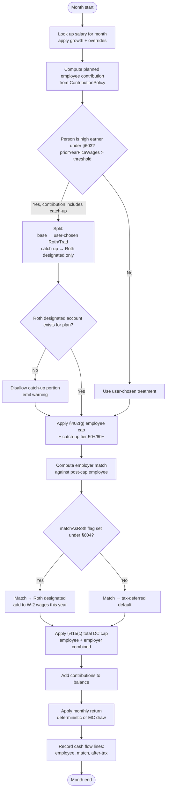

# ADR-003: Accumulation Phase & Contribution Model

- **Status**: Accepted
- **Date**: 2026-06-08
- **Deciders**: Owner
- **Related**: DISC-001, ADR-002 (domain), ADR-004 (tax), ADR-005 (returns)

## Context

The spreadsheet hand-waves the accumulation phase: a single
pre-retirement return rate compounded from "today's balance" to
retirement date, with no contribution stream. Real plans involve:

- Multiple contributing accounts (per-spouse 401(k), IRA, HSA, taxable)
- Salary-driven contributions (% of salary or fixed $)
- Annual contribution rate escalation ("auto-increase" features)
- Employer match formulas (often tiered: e.g. 100% of first 3%, 50% of
  next 2%)
- IRS contribution limits — annual, account-type-specific, with 50+ and
  60+ catch-up tiers, and indexed for inflation
- Salary growth, including discrete events (promotions, job changes)
- Bonuses

The engine must produce a continuous monthly time series from "today"
through end-of-plan, with the accumulation phase computing
contributions + growth correctly and yielding the retirement-date
balance that downstream phases consume.

## Decision

### ContributionPolicy Value Object
Each contributing account carries an optional `ContributionPolicy`:

```java
record ContributionPolicy(
    ContributionAmount employee,           // PERCENT_OF_SALARY(bd) | FIXED_DOLLAR(Money)
    Optional<EscalationPolicy> escalation, // e.g. +1%/yr, capped at 15%
    Optional<EmployerMatch> match,         // tiered match formula
    Optional<LocalDate> startDate,         // null = "now"
    Optional<LocalDate> endDate            // null = "until retirement"
) {}
```

`EmployerMatch` supports tiered formulas:
```java
record EmployerMatch(List<MatchTier> tiers) {}
record MatchTier(BigDecimal employeeContribPctUpTo, BigDecimal matchPct) {}
// e.g. [(0.03, 1.00), (0.05, 0.50)]  →  100% of first 3%, 50% of next 2%
```

### Salary Model
Per-`Person`:
```java
record SalaryProfile(
    Money currentSalary,
    BigDecimal annualGrowthRate,
    List<SalaryOverride> overrides,        // discrete events
    Optional<BonusPolicy> bonus
) {}

record SalaryOverride(LocalDate effectiveDate, Money newSalary);
record BonusPolicy(BonusType type, BigDecimal amountOrPercent, Month payoutMonth);
```

Salary at month `m` = piecewise-defined: between overrides, apply
annual growth rate; at an override, jump to the new salary.

### IRS Limits Dataset
Bundled as a config table (YAML/JSON in resources, replaceable without
code change):

```yaml
limits:
  - year: 2026
    employee_401k_under_50: 23000
    employee_401k_50_plus: 30500
    employee_401k_60_plus: 34750   # SECURE 2.0 super-catch-up
    ira_under_50: 7000
    ira_50_plus: 8000
    hsa_self_only: 4150
    hsa_family: 8300
    hsa_55_plus_catchup: 1000
    total_dc_under_50: 70000        # 415(c) total DC plan limit
    total_dc_50_plus: 77500
```

Future years are projected by applying an `assumptions.contributionLimitGrowthRate`
(typically tied to CPI) until a real published limit replaces it. The
projector logs which limits are projected vs. published.

### Engine Behavior During Accumulation
For each month in the accumulation phase, for each contributing account:

1. Compute the planned employee contribution from current salary × policy.
2. Apply the §402(g) elective-deferral limit to the **employee** portion
   only (e.g. 401(k)/403(b) elective deferrals capped at $23k + age-tier
   catch-up). IRA limits and HSA limits apply analogously per account
   type.
3. Compute the employer match against the **post-cap** employee
   contribution (you don't get a match on a deferral you weren't allowed
   to make). The employer match itself is **not** subject to the §402(g)
   elective-deferral limit.
4. Apply the §415(c) total-DC-plan limit to **employee + employer
   combined** per plan per year. If the cap is hit mid-year, additional
   employer match for the remainder of the year is also blocked.
5. Add contributions to balance.
6. Apply monthly return (deterministic rate or Monte Carlo draw).
7. Record the cash flow line item for audit/reporting (separate lines
   for employee, employer match, and any after-tax — useful for
   downstream tax basis tracking).

**Limit hierarchy (per person, per year):**
- §402(g): caps employee elective deferrals across all 401(k)/403(b) plans
- §408(b)/(p)(2)(C): caps Trad+Roth IRA contributions (combined)
- §223: caps HSA contributions
- §415(c): caps employee + employer combined per defined-contribution plan
- Catch-up tiers (50+, 60+) extend §402(g) and §223 but not §415(c)

### SECURE 2.0 Allocation Rules (in addition to limits)

SECURE 2.0 doesn't only change *how much* can be contributed — it also
changes *what tax treatment applies* in two cases:

#### §603: Mandatory Roth catch-up for high earners (effective 2026)
For an employee whose **prior-year FICA wages from the same employer**
exceeded a threshold (`$145,000` in 2023 dollars, **indexed annually**
to inflation), all catch-up contributions to a 401(k) / 403(b) / 457(b)
plan **must be designated Roth**, regardless of where the employee
directs them.

Engine implementation:
- Each contributing 401(k)/403(b) account has an associated
  `priorYearFicaWages: Optional<Money>` per Person (derived from the
  salary profile or user-entered).
- At the start of each contribution year:
  - If `priorYearFicaWages > §603 threshold[year]`, route the
    catch-up portion of any elective deferral to a Roth designated
    sub-account (modeled as a Roth 401(k) account hosted at the same
    plan).
  - The non-catch-up base deferral retains its pre-tax/Roth
    designation per the user's policy.
- If the plan being modeled has no Roth designated component (i.e.
  no Roth 401(k) account exists for that employer), the engine
  **disallows** the catch-up portion and emits a warning. (This
  matches how plans without Roth options will have to behave — they
  effectively can't accept catch-up from high earners after 2026.)
- The threshold is data in the same YAML as IRS limits:

  ```yaml
  - year: 2026
    secure_2_0_603_high_earner_threshold: 145000   # placeholder; use
                                                   # the actual indexed
                                                   # 2026 figure when known
  ```

The threshold is based on **prior-year FICA wages**, not current
salary, not AGI. The model captures this distinction; the contribution
year `Y` looks at year `Y-1` wages.

`priorYearFicaWages` is sourced as follows:
- For year `Y` where `Y - 1` is at or after `SalaryProfile.baseDate`,
  the engine integrates from the salary stream (annualized salary at
  end of year `Y-1` plus any bonus paid in year `Y-1`).
- For the simulation's first year, there is no preceding simulated
  year. Users may supply an explicit baseline
  (`SalaryProfile.priorYearFicaWages`) — a copy of their most recent
  W-2 Box 3. If absent, the engine back-derives an approximation as
  `currentSalary / (1 + annualGrowthRate)` and treats the result as
  best-effort. The approximation is documented in code; users
  straddling the threshold should supply the explicit baseline.

§603 routes only the **employee catch-up portion** of an elective
deferral. Employer-match treatment is governed independently by §604;
the match remains on the source account unless §604 is elected. A high
earner whose catch-up is forced to Roth still has their employer match
flow to the Trad 401(k)/403(b) by default.

#### §604: Roth treatment of employer matching (optional)
SECURE 2.0 §604 allows plans to permit employees to elect that their
employer match be treated as Roth. When elected, the match is included
in the employee's gross income in the contribution year, and the
matched dollars accumulate tax-free thereafter.

By default in the engine, employer match goes to **tax-deferred**
treatment (matching the historical and still-most-common behavior). A
per-account opt-in flag (`matchAsRoth: Boolean`) lets the user model
the §604 election where the plan supports it. When set:
- Matched contributions accrue to a Roth designated sub-account.
- An adjustment is added to the employee's W-2 wages for that year
  (handled by the tax engine, ADR-004).

#### Why this matters at the model level
The user's contribution policy might say "5% to Trad 401(k)", but the
engine cannot honor that 1:1 once §603/§604 rules apply. The
contribution stream therefore splits into routing decisions at runtime,
not at policy-definition time. A single elective deferral may produce
*two* cash flows in the same month: one pre-tax (base deferral) and
one Roth (catch-up portion under §603).

#### Engine Output Contract

Once §603 and §604 routing exist, the engine cannot adequately describe
its work with cash flows alone — it must also report when the user's
intent could not be honored (e.g. a high earner whose plan has no Roth
designated component). The contract:

- `ContributionEngine.contributeForMonth(...)` returns a structured
  `MonthlyContributionResult(List<CashFlow> flows, List<EngineWarning>
  warnings)` — warnings are a first-class output, not log lines.
- `EngineWarning.kind` is a stable enum
  (e.g. `SECTION_603_NO_ROTH_DESTINATION`). Adding new values is
  backward-compatible; renaming is a breaking change. Frontend i18n
  keys map to enum names.
- A single contribution-policy line can produce **two** `CashFlow`
  rows in the same month (base + routed catch-up under §603, base
  match + Roth match under §604). UI totals must aggregate by
  account/month, not assume one row per (policy, month).
- §603 and §604 are orthogonal: a high earner may have catch-up routed
  to Roth (§603) while their match stays Trad (§604 not elected), or
  vice versa. The shape accommodates both.

Frontend consumers (and future API contracts) should surface warnings
next to the contribution display so users can act on them — e.g. a
high earner whose plan lacks a Roth designated account needs to know
their catch-up was disallowed, not silently dropped.

At year boundaries: increment year counter, refresh annual limits,
apply contribution-rate escalation, apply salary growth.

## Rationale

- **Parametric model** matches the user's mental model and avoids forcing month-by-month entry.
- **Separating ContributionPolicy from Account** keeps the account simple and lets policies be edited in isolation. Also supports modeling "contribute to 401(k) first, then taxable when 401(k) caps out."
- **IRS limits as config** insulates the codebase from yearly tax-law changes. The 60+ super-catch-up is in SECURE 2.0 (2025+) and the limit table format must accommodate it.
- **Salary overrides + growth rate** matches the discovery decision: smooth growth as the default, discrete events for known changes. Avoids forcing users to enumerate segments.
- **Monthly cadence** matches Sheet2 and is fine-grained enough for tax-year boundaries to land cleanly.

## Consequences

**Positive**
- Engine has one accumulation loop, no special cases per account type
- Limits update annually by editing config
- Same engine handles deterministic and Monte Carlo modes — only the return-draw step differs

**Negative**
- 415(c) total DC limit requires aggregating across multiple accounts in a per-person view; the engine carries a per-person, per-plan bucket of "DC contribs this year" tracking employee and employer separately
- The cap-then-match-then-aggregate order is non-trivial to get right; needs unit tests for the standard combinations (cap-binding employee, cap-binding 415(c), tiered match interacting with mid-year catch-up eligibility)
- §603 routing means a single contribution policy may produce contributions to **two** accounts (pre-tax base + Roth catch-up). The engine and the cash-flow ledger must support this split.
- §603 needs `priorYearFicaWages` per Person per Employer — for the first simulation year there's no preceding simulation year, so this must be a user-entered input (the most-recent W-2). The salary profile derives subsequent years.
- ADR-003 now constrains the engine's **response shape** (`MonthlyContributionResult` with structured warnings), not only its math. Frontend and API consumers depend on this shape; changes to the warning enum or result record are breaking.
- Modeling Mega Backdoor Roth (after-tax 401(k) contributions up to 415(c)) is out of v1 — flag in PRD
- Bonus modeling depth (lump-sum vs. % of salary) is in scope but the policy shape may evolve; v1 keeps it simple

## Alternatives Considered

- **User enters contributions month-by-month** — rejected; tedious and error-prone.
- **Single salary growth rate with no overrides** — rejected per discovery decision.
- **Hard-coded IRS limits in code** — rejected; annual updates would require releases.

## Diagram — per-month contribution algorithm



## Notes

- The contribution-limit dataset should ship with at least the current and prior 3 years of real published limits, plus projection assumptions for the rest.
- A separate ADR is *not* needed for the SECURE 2.0 super-catch-up; it's just a column in the limits table.
- See ADR-005 for how monthly returns are drawn.
