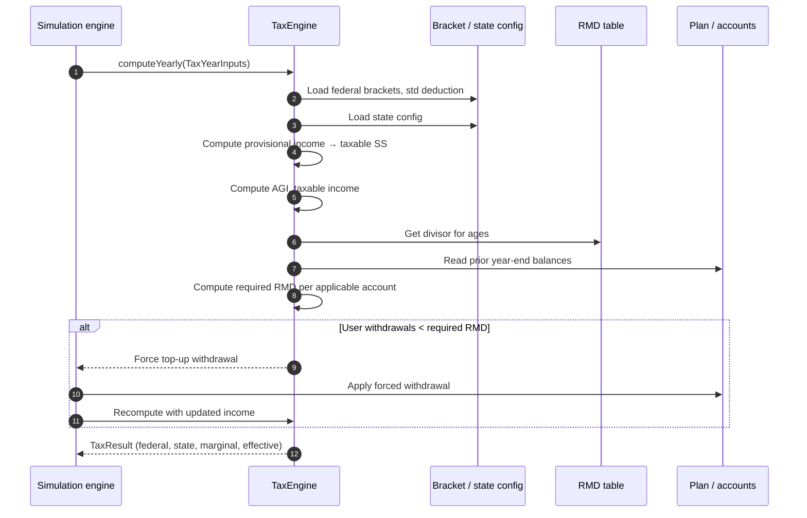
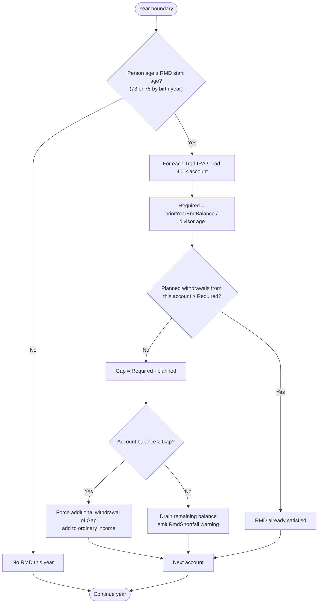

# ADR-004: Tax Engine

- **Status**: Accepted
- **Date**: 2026-06-08
- **Deciders**: Owner
- **Related**: DISC-001, ADR-002 (domain), ADR-003 (contributions)

## Context

DISC-001 commits to "full" tax modeling: federal income tax with
brackets and standard deduction, taxable Social Security calculation,
Required Minimum Distributions (RMDs) at 73/75, Roth conversion
modeling, and state income tax. The engine needs a clean structure for
this without hard-coding any single year's tax law.

## Decision

### Fidelity Bar
The tax engine is **directionally correct**, not a tax preparation
tool. Its job is to inform decisions ("does a Roth conversion make
sense in 2031?"), not to produce filing-grade returns. We model:

- The handful of provisions that materially change the answer for a
  typical retiree — federal brackets, standard deduction, taxable SS,
  RMDs, capital-gains brackets, state model + bracketed/flat rate +
  retirement-income subtractions where they're large.

We do **not** chase every state-specific quirk, every credit, every
filing-status edge case. When two reasonable taxpayers in the same
state would face different actual tax bills due to a niche provision
the engine doesn't model, that gap is acceptable as long as the
*planning decisions* the user would make remain correct. If a quirk
ever proves to drive a different decision, it gets added.

This bar applies state-by-state. New states are merged when their
config captures enough provisions to inform retirement decisions for
that state — not when every line of the state's return is modeled.

### Tax Engine as a Pluggable Component
A `TaxEngine` interface produces, for a given tax year and household
state, a `TaxResult`:

```java
interface TaxEngine {
    TaxResult computeYearly(TaxYearInputs inputs);
}

record TaxYearInputs(
    int year,
    FilingStatus filing,
    State state,
    int primaryAge, int spouseAge,
    Money wages,                    // both spouses combined
    Money traditionalWithdrawals,
    Money rothWithdrawals,
    Money taxableInterest,
    Money taxableDividends,
    Money taxableCapitalGains,
    Money socialSecurityGross,
    Money rothConversionAmount,     // taxed as ordinary income
    Money hsaQualifiedWithdrawals   // tax-free
) {}

record TaxResult(
    Money grossIncome,
    Money agi,
    Money taxableSocialSecurity,
    Money taxableIncome,
    Money federalTax,
    Money stateTax,
    Money totalTax,
    BigDecimal effectiveRate,
    BigDecimal marginalRate,
    Optional<RmdShortfall> rmdViolation
) {}
```

### Configuration-Driven Brackets
Federal brackets, standard deduction, and Social Security taxability
thresholds live in YAML by year:

```yaml
federal:
  - year: 2026
    standard_deduction:
      single: 15000
      mfj: 30000
    brackets_mfj:
      - { upTo: 23200,  rate: 0.10 }
      - { upTo: 94300,  rate: 0.12 }
      - { upTo: 201050, rate: 0.22 }
      # ...
    ss_taxability:
      provisional_income_threshold_1_mfj: 32000
      provisional_income_threshold_2_mfj: 44000
```

State tax: one config file per state. Schema accommodates:
- Tax model: `BRACKETED | FLAT | NONE`
- Brackets per filing status (when bracketed) or single flat rate
- Standard deduction (where the state has its own; many states start from federal AGI)
- **Retirement-income subtractions**: per-state exclusions that materially change the bill for retirees (e.g. CO's pension/annuity subtraction by age tier; NC's Bailey settlement exclusion; GA's age-65 retirement-income exclusion; PA's near-total exclusion of qualified retirement income; IL's pension exclusion; SS taxability override where the state diverges from federal)
- Source citation (DOR URL, year)

Only states relevant to the user are implemented in v1; the loader
gracefully refuses unsupported states with a clear error message
("State tax model for X not yet implemented"). Per the Fidelity Bar
above, each state's config aims to capture enough provisions to inform
retirement decisions for that state, not to produce filing-grade
output.

### RMD Calculation
The IRS Uniform Lifetime Table is bundled as config (age → divisor).
RMDs apply starting at age 73 (current SECURE 2.0 rule, 75 for those
born 1960+; the engine looks up the threshold from a small config table
keyed by birth year). RMDs apply to:
- Traditional IRA, Traditional 401(k), other pre-tax retirement
- NOT Roth IRA, NOT Roth 401(k) post-2024 (SECURE 2.0 removed Roth
  401(k) RMDs)

Each year the engine:
1. Computes required RMD per applicable account: `prior_year_end_balance / divisor[age]`
2. If user-planned withdrawals from that account already meet or exceed
   the RMD, no action
3. Otherwise, the engine forces an additional withdrawal to bring the
   total to the RMD; this withdrawal is added to ordinary income

If a forced RMD would drain the account below zero (rare edge case),
the engine emits an `RmdShortfall` warning rather than failing the
simulation.

### Roth Conversions
A `RothConversion` is a user-planned event (similar in shape to
`RolloverEvent`):
```java
record RothConversion(
    int taxYear,
    AccountRef sourceTraditional,
    AccountRef destinationRoth,
    ConversionAmount amount  // FIXED(Money) | FILL_BRACKET(targetMarginalRate)
) {}
```

`FILL_BRACKET` lets users say "convert just enough to fill the 12%
bracket each year" — the engine solves for the conversion amount that
brings taxable income to the top of that bracket.

### Taxable Social Security
Standard IRS provisional-income calculation:
- `provisional = AGI (excl. SS) + tax-exempt interest + 0.5 × SS benefits`
- Apply two-tier thresholds to determine 0% / 50% / 85% taxable

### Engine Position in the Simulation
The simulation engine calls `TaxEngine` once per simulation year (not
per month) to compute the tax bill. Withholding/estimated-tax cash flow
within the year is approximated as a December debit to taxable cash;
v1 doesn't model quarterly estimated payments.

## Rationale

- **Pluggable interface** lets us swap in test fixtures and lets future-
  tax-law changes happen as data updates.
- **YAML config for brackets** is the right granularity. Brackets change
  often; redeploying for a tax-law update is appropriate, but recompiling
  is not.
- **RMD as forced top-up** matches reality: the IRS doesn't care how you
  get there, just that you withdraw at least the RMD amount.
- **FILL_BRACKET conversion mode** captures the most common Roth-
  conversion-ladder strategy in a single declarative input — better than
  forcing users to compute the dollar amount themselves.

## Consequences

**Positive**
- Tax-law changes are config edits, not code changes
- Engine produces an auditable tax line per year with effective and marginal rates — useful for chart annotations
- Roth conversion modeling sits cleanly alongside withdrawals, doesn't pollute the main loop

**Negative**
- State tax adds per-state config work; v1 ships only the user's state(s)
- Capital gains modeling is simplified — long-term-only, single rate per bracket; no NIIT, no AMT in v1
- No state-specific quirks in v1 (e.g. PA's exclusion of retirement-account income, NJ's treatment of contributions)

## Alternatives Considered

- **Approximate marginal rate** (a single user-supplied number) — rejected; user explicitly wanted full bracket math.
- **Hard-code current-year brackets in Java** — rejected; non-trivial yearly maintenance.
- **Skip RMDs in v1** — rejected; user explicitly included RMDs.

## Diagrams

### Year-end tax computation sequence



### RMD enforcement decision



## Notes

- v1 implements federal + one or two states (TBD with the user). PRD will list the supported states.
- The Joint and Last Survivor RMD table is deferred until needed (DISC-001 deferred questions).
- NIIT (Net Investment Income Tax) and AMT are noted as v2 work in the PRD.
- A `TaxEngine` integration test should round-trip a small set of known-result returns from public sources to validate the bracket math.
