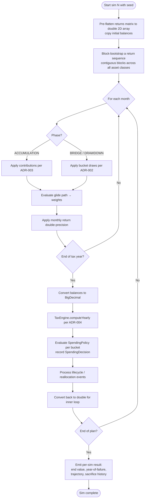

# ADR-005: Monte Carlo Simulation & Historical Returns

- **Status**: Accepted
- **Date**: 2026-06-08
- **Deciders**: Owner
- **Related**: DISC-001, ADR-002 (domain), ADR-006 (persistence)

## Context

DISC-001 commits to glide-path asset allocation Monte Carlo sourced
from historical-bootstrap returns stored in Parquet. The engine must:
- Draw correlated multi-asset monthly returns
- Honor a glide path that shifts allocation over time
- Run thousands of simulations within a small wall-clock budget
- Be reproducible (seedable) for testing and shareable scenarios

## Decision

### Asset Classes (v1)
A small, defensible set bundled with the app:
- US Large Cap (e.g. S&P 500 total return)
- US Small Cap
- International Developed
- Emerging Markets
- US Aggregate Bonds
- US TIPS
- Cash (T-Bills)

Each asset class has a monthly-return time series in a Parquet file:
`returns_<asset>.parquet` with columns `date, return_pct`.

### Glide-Path Asset Allocation
Per `Plan`, an `AssetAllocationPolicy` defines target allocations as a
function of age (or years-from-retirement):

```java
record AssetAllocationPolicy(List<GlidePathPoint> points) {}

record GlidePathPoint(
    int referenceAge,
    Map<AssetClass, BigDecimal> weights  // sum to 1.0
);
```

Between points, weights interpolate linearly. The engine evaluates the
policy at each simulation month to get the active weights.

### Bootstrap Sampling Strategy
**Block bootstrap** (not single-month i.i.d.) is the chosen sampling
method to preserve return autocorrelation and macro regimes:

1. Pick a block length (default 12 months — captures one-year regimes;
   configurable per scenario).
2. For each simulation, sample contiguous blocks of historical
   multi-asset returns until the simulation horizon is filled.
3. Each block is sampled across all asset classes simultaneously to
   preserve cross-asset correlations.

This is materially better than independent-monthly sampling, which
underweights tail risk.

### Reproducibility
Every Monte Carlo run carries a `seed` (long). Same plan + same seed +
same dataset = same result. Default seed for the UI is "now in epoch
millis" but stored on the scenario after the run.

### Performance Targets
DISC-001 success criteria: 1000 simulations of a 50-year plan in
< 5 seconds server-side.

A 50-year plan = 600 months × 1000 sims = 600,000 month-simulations.
At ~10 µs per month (allocation interp + return draw + balance update +
cash-flow application), this is 6 seconds — tight. Mitigations:
- Java parallel streams across simulations (each sim independent)
- Pre-flatten returns matrix into a `double[][]` at the start of a run
  (escape from BigDecimal for the Monte-Carlo-only inner loop; convert
  back at year-end for tax/RMD which need exact decimals)
- Reuse `Random` instance per worker thread

The dual-precision approach (BigDecimal for accounting, double for
inner-loop returns math) is **explicitly allowed by ADR-007**, which
otherwise mandates BigDecimal everywhere.

### Adaptive Spending Hook
Per ADR-002, buckets carry `SpendingPolicy` and the engine evaluates it
at year boundaries. In the Monte Carlo inner loop:

- Returns and balance accumulation run month-by-month in the
  `double`-precision hot path.
- At each **year boundary**, the loop converts to `BigDecimal`, calls
  into bucket `SpendingPolicy.evaluate()` for each bucket (passing
  current portfolio state, recent market state — e.g. trailing 12-month
  return, drawdown from peak), records the resulting `SpendingDecision`,
  and applies the scaled draws.
- The year boundary already does tax/RMD work (per ADR-004), so this
  doesn't add a new conversion checkpoint — it adds a per-bucket
  `evaluate()` call inside the existing checkpoint.

Cost: `O(simulations × years × buckets)` policy evaluations. With 1000
sims × 50 years × ~5 buckets = 250k evaluations per run. Each evaluation
is cheap (compare a few decimals, return a record), so this stays
within the 5-second budget. Verified by a JMH benchmark in addition to
the inner-loop benchmark.

### Output
Each Monte Carlo run produces:
- Per-simulation: end-of-plan portfolio value, year-of-failure (if any),
  full balance trajectory (sampled to a configurable resolution to keep
  storage bounded — e.g. yearly snapshots, not monthly), and a
  per-bucket spend-decision history (which buckets were scaled or
  deferred in which years).
- Aggregated: success probability, percentile bands (10/25/50/75/90),
  worst-case trajectory, and **bucket-sacrifice statistics** — e.g.
  "Travel was reduced ≥20% in 12% of simulations; Legacy target was
  missed in 8%." Per ADR-002 rationale, this is what makes adaptive
  spending actionable.

Results are persisted as Parquet (one file per run) per ADR-006.

## Rationale

- **Block bootstrap > i.i.d. sampling** is established practice in
  retirement-planning Monte Carlo for tail-risk realism.
- **Glide path** lets users model "stocks-heavier early, bonds-heavier
  late" without separately modeling rebalancing logic — the policy *is*
  the rebalance.
- **Dual precision** is the only realistic way to hit 5 seconds for
  1000 sims × 600 months. Confining the double-precision math to the
  Monte-Carlo inner loop (which doesn't touch tax-relevant accounting)
  keeps the BigDecimal contract intact at the boundary.
- **Bundled Parquet datasets** (per ADR-001) keep first-run trivial.
  Annual updates ship as new releases.

## Consequences

**Positive**
- Realistic tail risk via block bootstrap
- Reproducible runs via seed
- Performance budget achievable
- Glide path is declarative; reusable across plans

**Negative**
- Historical bootstrap is bounded by available history (< 100 years for
  most asset classes); can't sample regimes that haven't happened.
  Acceptable; user is informed in the UI.
- Block-length choice is a tunable; a default of 12 months works but
  documentation must explain the trade-off.
- Two precision regimes in one engine require care at the boundary.
  Test rigorously where conversion happens.

## Alternatives Considered

- **Normal-distribution returns (mean + stdev)** — rejected; understates
  tail risk.
- **Geometric Brownian motion / lognormal** — rejected for same reason.
- **Single-month i.i.d. bootstrap** — rejected; loses autocorrelation.
- **Use BigDecimal in inner loop** — rejected on performance; would not hit budget.

## Diagram — single simulation lifecycle



The `double` ↔ `BigDecimal` boundary in this flow is the bounded
exception sanctioned by ADR-007.

## Notes

- The historical-returns dataset choice (which index for "US Large Cap"?)
  should be documented in the data README. Default suggestion:
  Shiller's S&P 500 monthly total return series (publicly available, long history).
- A separate ADR may be warranted later for **rebalancing model**
  (continuous vs. annual vs. threshold-based). v1 uses continuous (the
  glide path *is* the allocation each month).
- A future enhancement: regime-aware sampling (e.g. condition on current
  CAPE) — out of v1.
