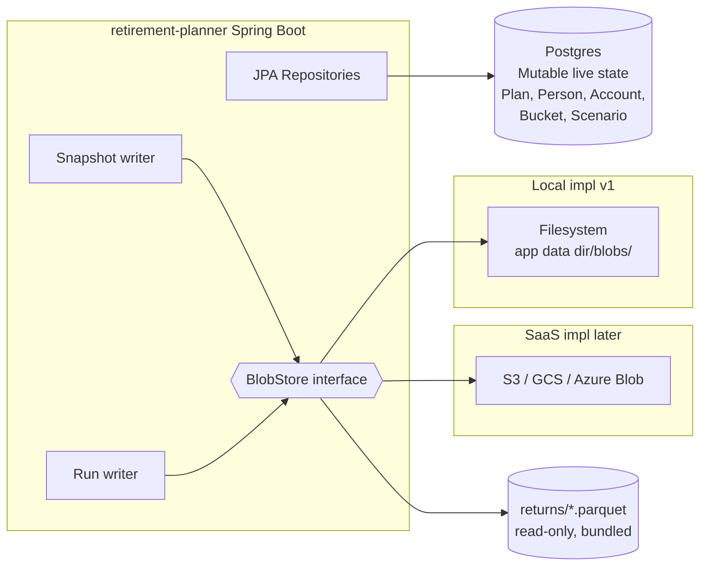
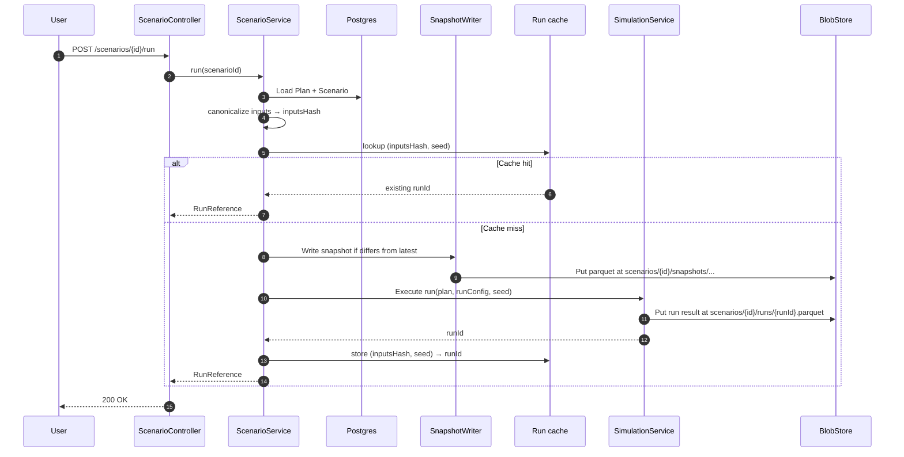

# ADR-006: Scenario Persistence & Versioning

- **Status**: Accepted
- **Date**: 2026-06-08
- **Deciders**: Owner
- **Related**: DISC-001, ADR-002 (domain), ADR-005 (MC results)

## Context

DISC-001 commits to PostgreSQL for live state and Parquet for scenario
versioning. The split has to be unambiguous: what lives where, when do
snapshots happen, how are they retrieved?

## Decision

### What lives in PostgreSQL
The **mutable, current state** of every aggregate in ADR-002:
- `Plan`, `Household`, `Person`, `SalaryProfile`
- `Account` (with current balances and contribution policies)
- `Bucket` (current configuration)
- `RolloverEvent`, `RothConversion`
- `Assumptions`
- `Scenario` metadata (name, description, owning plan, latest run reference)

Schema managed by **Flyway migrations** in `src/main/resources/db/migration/`.
Every schema change ships as a versioned migration; no auto-DDL in any
environment.

### What lives in Parquet
The **immutable history** and **simulation outputs**:

1. **Scenario snapshots** — when a user saves a scenario, a Parquet file
   captures the full Plan + Scenario state at that moment. Filename
   includes scenario id, version number, and timestamp. Used for
   audit/history view and as the input fingerprint for cached MC runs.
2. **Monte Carlo run results** — one Parquet per run with per-simulation
   end values + the configured-resolution trajectory.
3. **Historical returns datasets** — bundled with the app (ADR-005),
   read-only.

### Storage Layout
Local filesystem in v1 via a `BlobStore` interface:

```java
interface BlobStore {
    void put(BlobKey key, byte[] content);
    byte[] get(BlobKey key);
    boolean exists(BlobKey key);
    Stream<BlobKey> list(String prefix);
}
```

Local impl writes to `${app.data.dir}/blobs/` with a sharded path
scheme. SaaS impl wraps S3/GCS/Azure-Blob — same interface. Per ADR-001
no cloud SDKs in production code paths until SaaS work begins.

Path conventions:
- `tenants/{tenantId}/scenarios/{scenarioId}/snapshots/v{n}-{timestamp}.parquet`
- `tenants/{tenantId}/scenarios/{scenarioId}/runs/{runId}.parquet`
- `data/returns/{assetClass}.parquet` (read-only, shared)

### Snapshot Lifecycle
- **On save**: when a user clicks "save" or "run scenario", a snapshot
  is written if the scenario inputs differ from the most recent
  snapshot.
- **On run**: the run result references the input-snapshot id; identical
  inputs + same seed reuse the cached run.
- **Retention**: indefinite for v1 (storage is cheap, snapshots are
  small). User can manually delete a scenario; that deletes the DB row
  and the prefix in BlobStore.

### Versioning Semantics
Each snapshot carries:
- `scenarioId`
- `version` (monotonic integer)
- `parentVersion` (for clone-and-tweak provenance)
- `inputsHash` (SHA-256 of the canonicalized input set)
- `createdAt`

`inputsHash` is the cache key for run results. The hash is computed by
canonicalizing inputs (sorted keys, normalized BigDecimals, etc.) — a
tiny library function with thorough tests.

### Library Choice
**Apache Parquet for Java** (parquet-mr) with **Apache Arrow** for the
in-memory representation. Arrow gives us a clean way to construct
columnar data without hand-rolling Parquet writers.

## Rationale

- **Postgres for live state** is the right call: relational integrity
  matters for entities with foreign keys, and JPA/Hibernate works.
- **Parquet for snapshots** is excellent for: small per-snapshot size,
  schema evolution, columnar reads for cross-scenario analysis, native
  Python tooling for any future ad-hoc analysis.
- **BlobStore abstraction** matches ADR-001's cloud-agnostic posture.
  Adding S3 later is a one-class change.
- **inputsHash as cache key** lets the UI reuse run results when a user
  navigates back to a scenario without re-running 1000 simulations.

## Consequences

**Positive**
- Scenarios have full audit history without bloating the relational schema
- Run results are reproducible from snapshot + seed
- Cross-scenario analysis is a Parquet read away (e.g. "compare end-of-plan
  distribution across all my scenarios" → load N parquet files)
- SaaS migration is a BlobStore impl swap

**Negative**
- Two persistence systems = two failure modes; need clear error paths if
  Parquet is unwritable but DB succeeded (or vice-versa).
- Parquet/Arrow add ~10–20MB to the runtime footprint. Acceptable.
- Schema evolution on snapshots requires care: read-side must tolerate
  older snapshot schemas. Use Parquet's schema evolution rules
  (additive-only) and version the snapshot schema explicitly.

## Alternatives Considered

- **All-Postgres with JSON columns for snapshots** — rejected; loses the
  columnar-analysis benefit and Parquet ecosystem tooling.
- **Event-sourced ledger of every input change** — rejected; over-engineered
  for this use case and harder to reason about for the user.
- **Filesystem-only (no DB) for v1** — rejected; gives up referential
  integrity and makes SaaS migration a rewrite.

## Diagrams

### Storage split



### Scenario save → snapshot → cached run



## Notes

- The DB schema's first migration (V1) creates: tenants, plans,
  households, persons, salary_profiles, accounts, buckets, rollover_events,
  roth_conversions, assumptions, scenarios. Junction tables as needed.
- Sealed-interface persistence (Bucket subtypes) uses a discriminator
  column + JSON column for type-specific fields. Convertible by a small
  factory.
- Scenario JSON import/export (deferred to v1.1 per DISC-001) becomes a
  Parquet → JSON adapter; the snapshot is already a serialized form.
