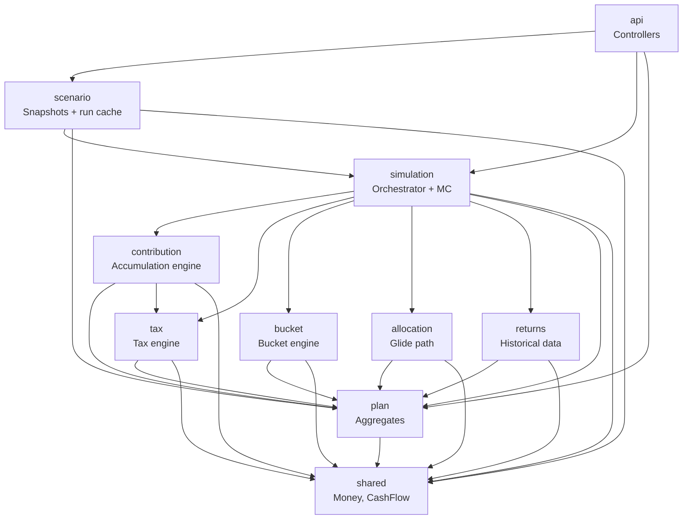
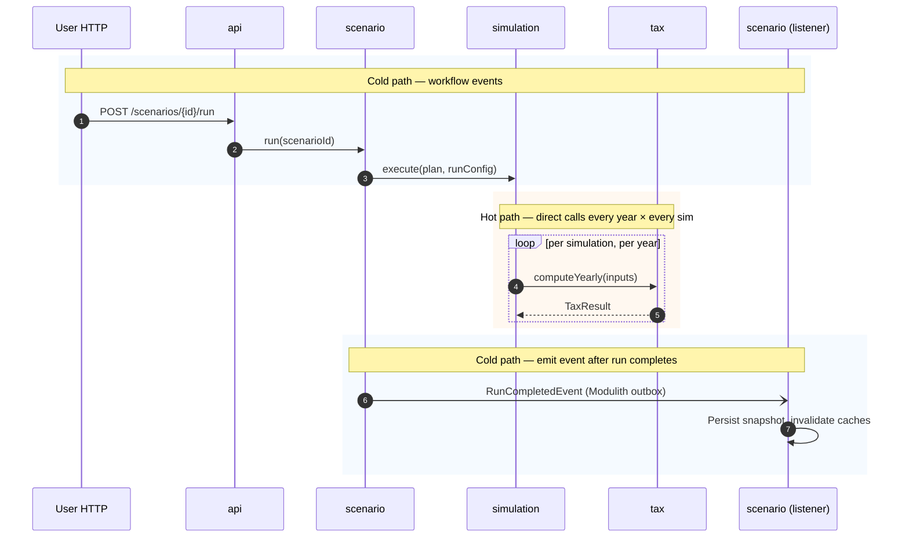

# ADR-008: Module Boundaries with Spring Modulith

- **Status**: Accepted
- **Date**: 2026-06-08
- **Deciders**: Owner
- **Related**: ADR-001 (platform), ADR-002 (domain), ADR-003 (contributions), ADR-004 (tax), ADR-005 (Monte Carlo), ADR-006 (persistence)

## Context

The application has ≥5 substantive subsystems with real, non-trivial
interactions:

- **Contribution engine** (ADR-003) — feeds Tax (W-2 wages, §604 gross-up); produces cash flows
- **Tax engine** (ADR-004) — consumes from Contribution and Bucket; produces RMD top-ups that flow back
- **Bucket engine** (ADR-002) — produces withdrawal cash flows; consumes from Tax for taxability of withdrawals
- **Simulation / Monte Carlo** (ADR-005) — orchestrates all of the above at month and year boundaries
- **Persistence** (ADR-006) — snapshots, run results; consumes from all

Without explicit module boundaries, these subsystems will leak into
each other. The first time the tax engine reaches into a
`ContributionPolicy` internal field, the architecture has slipped.

Three options were considered for enforcing boundaries:

1. **Plain packages with discipline** — package-private visibility,
   well-named packages, code review.
2. **Java SPI / ServiceLoader** — interface-based extension points
   loaded at runtime.
3. **Spring Modulith** — explicit module boundaries verified at build
   time, optional event-driven communication, generated module docs.

## Decision

**Adopt Spring Modulith** for module boundaries and CI-enforced
verification. **Use it surgically** — Modulith is structure and
verification, not a new runtime style. Inter-module communication
remains direct method calls on injected interfaces in the simulation
hot path; Modulith events are reserved for user-initiated workflow
boundaries.

### Module Topology
Top-level Java packages, each a Modulith module:

```
io.github.xmljim.retirement.retirementplanner
├── plan/                     # Plan, Household, Person, Account, Sleeve aggregates
├── contribution/             # Accumulation engine: contributions, IRS limits, §603/§604 routing
├── accumulation/             # Accumulation engine: per-month sleeve yield (S-2.7), projector (S-2.8)
├── tax/                      # TaxEngine, brackets, RMDs, Roth conversions, taxable SS
├── bucket/                   # Bucket interface, FundingPolicy, SpendingPolicy, LifecyclePolicy
├── allocation/               # AssetAllocationPolicy, glide path, asset classes
├── returns/                  # Historical returns dataset access, BlobStore reads
├── simulation/               # Orchestrator: month-by-month projection, MC engine
├── scenario/                 # Scenario, Snapshot, run caching, BlobStore writes
├── api/                      # Controllers (delegating only — ADR-001/CLAUDE.md)
└── shared/                   # Money, value records, common interfaces (CashFlow, etc.)
```

Each module exposes only its **public API package** (`<module>.api`
or simply the module's root package); everything else is
package-private. `ApplicationModules.verify()` runs in CI and fails
the build on illegal cross-module access.

### Communication Patterns

**Direct interface calls — used in the simulation hot path:**
```java
// simulation/MonteCarloEngine
private final TaxEngine taxEngine;
private final ContributionEngine contributionEngine;
private final BucketEngine bucketEngine;

// at year boundary, called inside the inner loop:
TaxResult tax = taxEngine.computeYearly(taxInputs);
```

This is plain Spring DI. Modulith doesn't change anything about it; it
just verifies that `simulation/` is allowed to depend on the *public
API* of `tax/`, and that the call site doesn't reach into `tax/internal/`.

**Modulith events — used at user-initiated workflow boundaries:**
```java
// scenario/ScenarioService
@ApplicationModuleListener
void on(ScenarioSavedEvent e) { snapshotWriter.write(e.scenarioId()); }

@ApplicationModuleListener
void on(RunCompletedEvent e) { runCache.invalidate(e.scenarioId()); }
```

Events are appropriate when:
- The trigger is human-initiated (save, run, delete)
- The handler can be eventually-consistent
- Multiple modules may react and we don't want the publisher to know about them

Events are **not** used in:
- The per-month or per-year simulation loop (latency budget would explode)
- Synchronous data dependencies (e.g. tax engine asking the contribution engine for W-2 wages — that's a method call)

### Module ↔ Aggregate Mapping
Most modules own one or more aggregate roots from ADR-002:

| Module | Owns | Public API |
|---|---|---|
| plan | Plan, Household, Person, Account, Sleeve | `PlanRepository`, value records |
| contribution | (no aggregates; engine-only) | `ContributionEngine` interface |
| accumulation | (no aggregates; engine-only) | `SleeveYieldEngine` interface (S-2.7); projector (S-2.8) |
| tax | (no aggregates; engine-only) | `TaxEngine` interface, `TaxResult` |
| bucket | (Bucket types are owned by `plan`; engine-only here) | `BucketEngine`, `SpendingPolicy` types |
| allocation | AssetAllocationPolicy | `AllocationPolicy` interface |
| returns | (no aggregates; data access) | `ReturnsDataset` interface |
| simulation | (orchestrator; no aggregates) | `SimulationService`, `MonteCarloService` |
| scenario | Scenario, Snapshot, Run | `ScenarioService`, `RunRepository` |

Note that **Bucket value types** (sealed interfaces from ADR-002) live
in `plan/` because they're part of the Plan aggregate's invariants;
the **bucket engine** in `bucket/` operates on them but doesn't own them.
This is the kind of distinction Modulith verification will surface
clearly.

### Internal Packages
By Modulith convention, `<module>/internal/` is private to that
module. Cross-module access to `internal/` fails verification. Use
this for entities that aren't part of the module's published contract:

```
tax/
├── TaxEngine.java               # public API
├── TaxResult.java               # public value record
└── internal/
    ├── BracketTable.java        # private — implementation detail
    ├── RmdTable.java            # private
    └── ProvisionalIncomeCalc.java
```

### Build & Test
- `ApplicationModules.verify()` runs as a unit test in CI — failing the
  build on boundary violations.
- `@ApplicationModuleTest` for per-module integration tests (boots only
  that module's Spring context with stubs for others).
- Module documentation generated via Modulith's PlantUML / AsciiDoc
  generators; checked in to `docs/architecture/modules/`.

## Rationale

- **Real boundaries deserve real enforcement.** The recurring §603/§604
  work shows contribution↔tax interactions are non-trivial; explicit
  contracts beat undocumented coupling.
- **CI-verified** is the lowest-friction enforcement available. Code
  review will miss boundary violations under deadline pressure;
  `ApplicationModules.verify()` won't.
- **Surgical use of events** keeps the latency budget intact. Events
  for user-initiated workflow are cheap and let us add new module
  reactions (audit logging, notifications, etc.) without changing
  publishers.
- **SPI rejected**: SPIs are for runtime extensibility by parties
  outside our codebase. We don't have that requirement and don't want
  the indirection cost.
- **Plain packages rejected**: works for tiny apps, fails at this size
  once 2–3 modules want to share a record type and one of them is
  tempted to reach into another's "internal" package.

## Consequences

**Positive**
- Boundary violations fail CI, not code review
- Module docs auto-generated and checked in — onboarding aid
- Per-module test boots are fast (only one module's beans)
- Future SaaS/multi-tenant work can split modules into separate deployable units later if needed (Modulith is the gradient between modular monolith and microservices)

**Negative**
- Adds Spring Modulith as a dependency (small footprint; same Spring vendor)
- Module structure is now load-bearing — moving a class between modules is a real change, not a casual refactor. Mitigation: think before extracting.
- Modulith events use a transactional outbox by default; for the events we'll use (save, run-complete, delete), this is desirable — no extra opt-in needed.
- A misuse risk: developers (or future-me) reaching for `@ApplicationModuleListener` for hot-path calls because "events are decoupled and that sounds good." The hot-path/cold-path rule is documented here and should be in CLAUDE.md.

## Alternatives Considered

- **Plain packages with discipline** — rejected; verification is cheaper than vigilance.
- **Java SPI / ServiceLoader** — rejected; wrong tool, no third-party extension requirement.
- **Multi-module Maven (placefinder pattern)** — viable but heavier than needed for solo dev. Modulith gives module boundaries within a single Maven module, which keeps the build simple. We can split into Maven modules later if the project grows enough to need separate artifacts (e.g. publish `tax-engine` as a library).
- **Hexagonal / Clean Architecture rings** — orthogonal to module boundaries. We can still apply ports-and-adapters discipline within a Modulith module if it helps a particular module. Don't conflate the two.

## Diagrams

### Module topology and allowed dependencies



Edges are **public-API dependencies only**. Reaching into another
module's `internal/` package fails `ApplicationModules.verify()`.

### Hot-path vs cold-path communication



The shaded blocks make the rule visible: events bracket the workflow,
direct calls run the math.

## Notes

- The default for any new code: put it in the smallest reasonable
  module's `internal/` package, then *promote* to the public API only
  when another module proves a need.
- Inter-module DTOs / value records: place in the module that *produces*
  them, not the consumer. (`TaxResult` lives in `tax/`, not `simulation/`.)
- `shared/` is reserved for genuinely cross-cutting types (`Money`,
  `CashFlow`). Anything ambiguous defaults out of `shared/` until
  ≥3 modules need it.
- Modulith works fine with Spring Boot 3.x and is fully supported on
  Spring 4.x (referenced by user).
- An `architecture-test` integration test runs `ApplicationModules.verify()`
  + a small set of explicit allowed-dependencies assertions for clarity.
