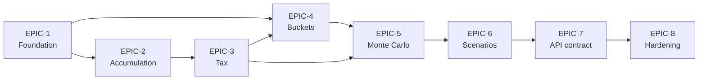

# Epics & User Stories

Decomposition of [PRD-001](../prd/PRD-001-retirement-planner.md) into 8
epics aligned to PRD milestones M1–M8. Each story carries:

- **Title** in imperative form
- **As-a / I-want / So-that** narrative
- **Acceptance criteria** (testable)
- **Points** in Fibonacci (1, 2, 3, 5, 8, 13)
- **Traces to** the FR(s) and ADR(s) that govern the story

Stories larger than 5 points are decomposed further. 8+ is a flag to split.

## Index

| Epic | Title | Milestone | Points | File |
|---|---|---|---|---|
| EPIC-1 | Foundation & Plan Aggregate | M1 | ~27 | [EPIC-1-foundation.md](EPIC-1-foundation.md) |
| EPIC-2 | Accumulation & Contribution Engine | M2 | ~45 | [EPIC-2-accumulation.md](EPIC-2-accumulation.md) |
| EPIC-3 | Tax Engine | M3 | ~39 | [EPIC-3-tax-engine.md](EPIC-3-tax-engine.md) |
| EPIC-4 | Buckets & Adaptive Spending | M4 | ~50 | [EPIC-4-buckets.md](EPIC-4-buckets.md) |
| EPIC-5 | Monte Carlo & Returns | M5 | ~35 | [EPIC-5-monte-carlo.md](EPIC-5-monte-carlo.md) |
| EPIC-6 | Scenario Management | M6 | ~17 | [EPIC-6-scenarios.md](EPIC-6-scenarios.md) |
| EPIC-7 | API & Frontend Contract | M7 | ~11 | [EPIC-7-api.md](EPIC-7-api.md) |
| EPIC-8 | Hardening & Observability | M8 | ~20 | [EPIC-8-hardening.md](EPIC-8-hardening.md) |

**Total**: ~244 points across v1.

## Points Guidance (Fibonacci)

| Points | Effort |
|---|---|
| 1 | Trivial — config/typo |
| 2 | Small — single file/component |
| 3 | Medium — few files, straightforward |
| 5 | Large — multiple files, real complexity |
| 8 | Too large — must split |

## Traceability Convention

- `FR-2.5` refers to functional requirement 2.5 in PRD-001
- `ADR-003` refers to ADR-003 in this directory's sibling `adr/`
- `NFR-1` refers to non-functional requirement 1 in PRD-001
- Sheet2 fidelity stories trace to the success criterion in DISC-001

## Cross-Epic Dependencies

EPIC-7 work spans the full project (OpenAPI generation runs from M1
onward); the dependency arrow indicates when the *contract is firm
enough* for the frontend to integrate.
